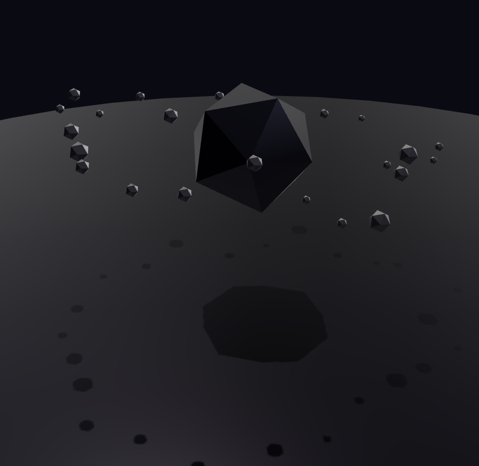

# threejs-scene



Lightweight imperative three.js app shell: `createApp` + a small module
contract. Deterministic clock, seeded rng, unidirectional state flow, strict
dispose chain. The successor core of `threejs-scenes` v3, rebuilt small.

## Install

```sh
npm i threejs-scene three
```

## Use

```ts
import { createApp, defineModule } from 'threejs-scene'
import { standardLighting } from 'threejs-scene/modules/lighting'
import { orbitControls } from 'threejs-scene/modules/orbit'

interface State { speed: number }

const turbine = defineModule<State>({
  name: 'turbine',
  build (ctx)                { /* create objects once, add to ctx.scene */ },
  update (state, frame, ctx) { /* project state onto them, every sim tick */ },
})

const app = createApp<State>(canvas, {
  state: { speed: 1 },
  seed:  7,
  clock: { mode: 'fixed', step: 1 / 120 },
  use:   [ standardLighting(), orbitControls() ],
})

app.use(turbine)          // runtime add; returned handle.remove() tears down
app.start()               // or app.tick() for deterministic stepping
app.setState({ speed: 2 })
app.dispose()
```

The contract: state flows down (`store -> module.update -> scene`, once per
simulation tick), input flows back through `setState`/`dispatch` — never
straight into scene objects. Same seed + same tick sequence reproduce the
exact same world, headless included.

## Post-processing

Post-processing is a pluggable module, same contract as lighting and orbit —
drop it into `use: [ … ]` and it owns the frame draw through a module `render`
hook (no composer wiring at the call site):

```ts
import { postProcessing, createGradePass } from 'threejs-scene/modules/post'
import { createChromaticAberration } from 'threejs-scene/modules/post/webgl/ca'

const app = createApp(canvas, {
  use: [
    standardLighting(),
    postProcessing({
      bloom:   { strength: 0.8 },
      depth:   true,                       // for DOF / god rays / motion blur
      effects: () => [ createChromaticAberration({ strength: 1.2 }), createGradePass({}) ],
      onFrame: ({ elapsed }, ctx) => { /* drive time/camera uniforms */ },
    }),
  ],
})
app.start()
```

It builds an `EffectComposer` (`RenderPass → optional UnrealBloom → your passes
→ OutputPass`, tone-mapped once at OutputPass). The WebGL effect catalogue —
bloom, god rays, colour grade, DOF, CRT, glitch, chromatic aberration, film
grain, and more — lives under `modules/post/` (the module plus the top-level
passes) and `modules/post/webgl/` (the full set). WebGL only for now.

Each effect exists exactly once. The shared GLSL kernels — the fullscreen vertex
shader, `hash`, chromatic aberration, vignette, grain — live in
`modules/post/shared/glsl.ts` and are composed into each pass, rather than being
re-inlined per file. Passes that own a look keep it: `createGradePass` defaults
its baked grain and chromatic aberration to `0`, so stacking it with
`createFilmGrainPass`/`createChromaticAberration` never double-applies either.

Every effect's parameters are adjustable live in the
[interactive demo](https://tuomashatakka.github.io/threejs-scene/app.html).

## Starter templates

Seven scaffolded apps — two isometric scenes, a third-person hovership racer,
a studio product display, the complete asset gallery, props compiled from
LLM-authored JSON, and a physics yard — are on the
[starters page](https://tuomashatakka.github.io/threejs-scene/starters.html),
each showing its complete source beside the running scene. The source is
imported twice (as a module to run, and via Vite's `?raw` to display), so the
code you read is provably the code you are watching.

Each one is a worked example of tying a camera to something else in the scene:

- **Isometric** — drag to pan, wheel/pinch to zoom. One `zoom` number drives the
  frustum, the rig's elevation, the fog band and the tilt-shift blur together,
  so zooming in tips the camera up toward the horizon as the bokeh thickens.
  Panning moves the terrain's *sample origin* rather than the camera, which is
  why the map is endless in every direction.
- **Hovership** — the ship reads the track's curvature ahead and brakes exactly
  as late as it can, so it runs flat out down the straights. The camera racks
  focus off that throttle: out to the horizon under acceleration, back onto the
  ship under braking, with the aperture opening through both.
- **Product** — the camera revolves around a product that never moves (so the
  key light rakes across it, which spinning the object cannot fake), and the
  pointer leans the rig a few degrees for parallax.
- **Asset gallery** — built directly from `ASSET_MANIFEST`: all five textures,
  twelve materials, and twenty-two prop presets, labelled through one atlas.
- **LLM prop authoring** — every object on the plinth was JSON a moment ago,
  compiled by `modules/assets`. Two of them came from deliberately sloppy
  model output; the console prints what each prop's critique would tell the
  model back.
- **Salvage yard physics** — cloth, liquid and kinetics in one deterministic
  world: a tarp breathing in the wind, a cohesive fluid surface sloshing in a
  cutaway basin, and independent barrels/crates coming down a ramp.

## Content: props, materials, textures

`modules/assets` is the content layer — plain factories rather than app modules:

```ts
import { Prop, markShared, createStandardMaterial, treeProp } from 'threejs-scene/modules/assets'

const ship = new Prop('ship')
  .addPart('hull', new THREE.Mesh(hullGeometry, createStandardMaterial('metal')))
  .addPart('canopy', new THREE.Mesh(domeGeometry, createStandardMaterial('glass')))

scene.add(ship)
ship.dispose()   // frees every geometry/material/texture it owns, exactly once
```

A `Prop` is a `THREE.Group` of child meshes with a disposal contract: it owns
everything it contains **unless** the resource is tagged with `markShared()`.
That makes sharing a pooled material a deliberate, visible act, and keeps
`dispose()` safe to call without blanking a neighbour's material.

The primary interface is synchronous and deliberately model-friendly:

```ts
import { createProp, tryCreateProp, ASSET_MANIFEST } from 'threejs-scene/modules/assets'

const barrel = createProp('barrel', { scale: 1.2 })
const crate  = createProp({ preset: 'crate', options: { seed: 7 } })
const custom = tryCreateProp(modelProducedJsonOrProse) // never throws

scene.add(barrel, crate)
if (custom.prop) scene.add(custom.prop)
```

Exact preset strings resolve first. Other strings go through forgiving JSON
extraction and validation. Preset options are described by exported parameter
specs: malformed values default/clamp and unknown keys are ignored.
`CREATE_PROP_SCHEMA` is the function-calling schema; `ASSET_MANIFEST` is a
JSON-serializable inventory of every option default, description, and tag.

Also here: eight PBR presets plus toon, procedural matcap, holographic, and
triplanar materials; five DOM-free procedural textures; shape profiles,
extrusion/lathe/path tubes, surface ribbons, twist/taper/bend/noise and topology
modifiers, merging/layout/bounds/connection/infinite-ground helpers; terse
primitive constructors (`box`, `cyl`, `cone`, `ball`, `hedron`, `plank`,
`blade`); owned prop registries, composites, and single- or multi-part
instancing.

### Seeing a prop without a browser

`validatePropSpec` says whether a spec is legal and `reviewProp` measures
whether the result floats, detaches or buries itself — but neither says what it
*looks* like, which leaves a model authoring geometry reasoning blind.
`rasterizeAscii` draws one geometry as text, with a real z-buffer, in about ten
milliseconds and with no canvas, GPU or image file anywhere in the loop:

```ts
import { mergeParts, part, box, cyl, rasterizeAscii, auditPalette } from 'threejs-scene/modules/assets'

const geometry = mergeParts([
  part(box(2, 1.2, 3), { color: '#8a5a3b' }),
  part(cyl(0.1, 0.1, 1.6, 5), { at: [ 0.7, 1.1, 0 ], color: '#3d3d42' }),
])

for (const view of [ 'iso', 'right' ] as const)
  console.log(rasterizeAscii(geometry, { view, cols: 72 }).lines.join('\n'))

// which palette entry each facet came from, and the height band it covers
console.log(auditPalette(geometry, { timber: '#8a5a3b', iron: '#3d3d42' }))
```

`ASCII_VIEWS` names the six angles worth looking from — `iso` because it is the
angle an isometric scene is played at, the four elevations because they are the
ones you can measure from. Both functions read `position` as a triangle soup,
which is exactly what `mergeParts` emits; call `.toNonIndexed()` first on
anything indexed.

### The low-poly prop kit

The same module carries the tooling a flat-shaded kit is actually built from —
bake the look into the vertices, collapse a prop into one geometry, and stamp it:

```ts
import {
  part, mergeParts,          // primitives → one merged, vertex-coloured geometry
  bakeFacetColors, applyGrime, kitMaterial,
  buildKitGeometry, kitProp, // 16 ready-made wasteland props
  createPlacementField, scatterInstances,
} from 'threejs-scene/modules/assets'

const material = kitMaterial()          // ONE material for the whole kit
const tower    = buildKitGeometry('watchtower')

// or build your own: primitives in, one draw call out
const crate = mergeParts([
  part(new THREE.BoxGeometry(1, 1, 1), { at: [ 0, 0.5, 0 ], color: '#8a6a44', rng }),
  part(new THREE.BoxGeometry(1.06, 0.08, 1.06), { at: [ 0, 0.12, 0 ], color: '#4a3728', rng }),
], { grime: 1 })
```

`part()` transforms a primitive and bakes one jittered shade per triangle;
`mergeParts()` collapses them through three's own `BufferGeometryUtils` and
darkens toward the base (the cheapest ambient occlusion there is). The result is
one geometry per prop *type*, which is the only form that can be instanced.

The kit: `ruined-block`, `crumbled-building`, `container`, `crate-stack`,
`watchtower`, `pylon`, `wreck-car`, `dead-tree`, `barrel-cluster`, `rubble-pile`,
`barricade`, `tire-stack`, `road-sign`, `crag`, plus atomic `barrel` and `crate`
— each seeded, so
`buildKitGeometry('crag')` is the same crag every time and
`buildKitGeometry('crag', { rng })` is a different one each call.

### Placement is a solver, not a list

You describe the rules; it finds the coordinates:

```ts
const field = createPlacementField({ rng, extent: 64, heightAt, minHeight: 0 })

const { mesh, placed } = scatterInstances({
  geometry, material, count: 40,
  place: () => {
    const spot = field.place({ radius: 2.7, minDistance: 10, avoidCorridor: 4.8 })
    return spot && { at: [ spot.x, heightAt(spot.x, spot.z), spot.z ], rotate: [ 0, rng.next() * 6.28, 0 ] }
  },
})
```

Keep-out spacing, a corridor to stay out of, a range, a waterline — enforced by
the field, not by the caller. Forty props, one draw call, per-instance tint so
identical geometry does not read as identical objects.

## Props from language models

`modules/assets` lets a **small** model author props. Not by writing
three.js — by filling in a tiny JSON dialect that is validated, compiled, and
then critiqued, so the model can fix its own mistakes:

```ts
import { createPropTool, generateProp, buildProp } from 'threejs-scene/modules/assets'

scene.add(buildProp({
  name:  'crate',
  parts: [
    { name: 'body', shape: 'box', size: [ 0.8, 0.8, 0.8 ], at: [ 0, 0.4, 0 ], color: '#8a6a44' },
    { name: 'band', shape: 'box', size: [ 0.84, 0.07, 0.84 ], at: [ 0, 0.08, 0 ],
      repeat: { count: 2, mode: 'linear', offset: [ 0, 0.64, 0 ] }},
  ],
}))
```

The dialect is designed around what small models get right. Units are metres,
y is up, the ground is `y = 0`. Every shape — `box`, `sphere`, `cylinder`,
`cone`, `pyramid`, `prism`, `capsule`, `torus`, `knot`, `crystal`, `rock`,
`wedge`, `plane`, `disc`, `ring` — is sized by the box it fills, so there are no
constructor signatures to remember. Rotations are in degrees. `repeat`
(`linear` / `radial` / `mirror`) covers legs, spokes and railings, so four table
legs are one part, not four chances to fat-finger a coordinate.

And `on` replaces the coordinate a model is least able to compute:

```jsonc
{ "name": "stem", "shape": "cylinder", "size": [0.09, 0.68, 0.09], "on": "base" },
{ "name": "top",  "shape": "cylinder", "size": [0.8, 0.05, 0.8],   "on": "stem" }
```

Metric estimation is the measured failure — GPT-4o scores ~10-12% on
object-distance and object-size on Apple's CA-VQA benchmark — while stating a
*relation* is something even small models get right. So the model says "the top
rests on the stem" and the solver computes the height before anything is built,
the same split Holodeck and SceneCraft arrived at.

Four pieces, each usable on its own:

```ts
import {
  validatePropSpec,   // repairs "cube" → "box", "position" → "at", "0.4" → 0.4, …
  buildProp,          // spec → Prop, deterministic, one geometry per part
  reviewProp,         // measures the BUILT prop: floats? detached? buried? too heavy?
  propAuthoringPrompt // the grammar + worked examples, ~2.8k chars (or 1.4k compact)
} from 'threejs-scene/modules/assets'
```

`createPropTool()` packages them as a provider-agnostic tool definition — a
name, a description, a JSON Schema (`CREATE_PROP_SCHEMA`), and a `run` that never
throws — so it drops into Anthropic `input_schema`, OpenAI/Gemini `parameters`,
an ai-sdk tool, or a constrained decoder for a local model.

`generateProp()` closes the loop, which is where the quality actually comes
from — one shot from a 3B model is a coin flip, but the same model, told *"the
prop floats 0.4m above the ground"*, usually fixes it next turn:

```ts
const { prop, review, attempts } = await generateProp({
  brief:    'a mossy stone well',
  attempts: 3,
  complete: async ({ system, prompt }) => callYourModel(system, prompt),  // any model, any SDK
})

scene.add(prop)
console.log(review.report)
// mossy stone well: 7 meshes, 1.4k triangles, 1.2 × 1.6 × 1.2m, sits on the ground
```

Everything is DOM-free and GL-free: a server can validate, build, measure, and
critique a prop with no canvas anywhere. See the **LLM prop authoring** starter
for the whole path running live, sloppy model output included.

## Physics: rigid bodies, cloth, and liquid

`modules/physics` is an optional layer over [cannon-es](https://github.com/pmndrs/cannon-es)
— the engine from three's own [libraries list](https://threejs.org/manual/#en/libraries-and-plugins)
that is pure ESM with no wasm and no async init, so it steps identically in a
headless test and in the browser. It is an **optional peer dependency**: this is
the only module that imports it.

```sh
npm i cannon-es
```

```ts
import { physicsWorld, addGroundPlane, addStaticBox, createCloth, createLiquid } from 'threejs-scene/modules/physics'

const physics = physicsWorld({ gravity: [ 0, -9.82, 0 ], iterations: 16 })
const app     = createApp(canvas, { use: [ standardLighting(), physics ] })

addGroundPlane(physics)
physics.add(crate, { mass: 8, friction: 0.85 })      // one compound rigid body
physics.addEach(crateGroup, { mass: 5 })             // direct children move independently

const tarp = createCloth(physics, {                  // cloth
  size: [ 4, 2.6 ], segments: 14, mass: 2.4,
  at: [ -2, 3.3, -1.6 ], pin: 'top-edge', wind: [ 0, 0, 4 ],
})
const pool = createLiquid(physics, {                 // position-based liquid
  count: 320, at: [ 4.2, 2.2, 0 ], spawn: [ 1.6, 1.1, 1.6 ],
  neighborRadius: 0.24, iterations: 4, viscosity: 0.02, cohesion: 0.01, rng,
})
scene.add(tarp.mesh, pool.mesh)
```

- **Rigid / kinetic** — `physics.add(object, { mass, shape, friction, restitution })`
  binds an `Object3D` as one body; `addEach()` binds direct children separately.
  Descendant bounds are measured in object-local space, the body is placed at
  their transformed centre, and `center` can override it. Parent transforms,
  base pivots, rotation, and bind-time scale remain aligned.
- **Cloth** — a grid of cannon particles held by distance constraints, in the
  *same* solver as everything else, so a barrel dropped on the tarp moves it and
  the tarp pushes back. `wind` is an acceleration in m/s², so behaviour does not
  change when you change the sheet's mass or resolution.
- **Liquid** — cannon spheres handle gravity and rigid obstacles while a
  spatial-hashed position-based solver performs four local density passes,
  artificial pressure, cohesion, and XSPH viscosity. Rest density calibrates
  from the spawn lattice. A live `MarchingCubes` surface is the default;
  `renderMode: 'particles'` is the low-power/debug alternative. Tune through
  `liquid.solver`; reset and disposal remain explicit.

The world is stepped at a **fixed** rate with an accumulator regardless of frame
rate, so the same start replays to the same pile — the determinism the rest of
the package promises survives contact with a falling object. `onStep` /
`onAfterStep` hook forces and readback around each step.

See the **Salvage yard physics** starter for all three running together.

## Cameras

Beyond the default perspective rig, `createApp({ camera })` accepts any prebuilt
camera — including the two the library ships:

```ts
import { createIsoCamera, resizeIsoCamera, aimIsoCamera, createFollowCamera } from 'threejs-scene'

const camera = createIsoCamera(aspect, { viewSize: 20, flavor: 'dimetric' })
const rig    = createFollowCamera({ offset: [ 0, 2.6, -7.5 ] })

camera.userData.viewSize = 12          // zoom is a frustum change …
resizeIsoCamera(camera, aspect)
aimIsoCamera(camera, { tilt: 22 })     // … and elevation is a pose change
```

`createIsoCamera` builds a true-iso or dimetric orthographic rig;
`createFollowCamera` is a damped third-person chase camera whose offset is
expressed in the target's local space, so it banks and turns with it.

`rig.aim(station)` re-aims a follow rig at runtime — seat, look point and both
damping half-lives — which makes swapping between camera stations a lerp of the
two presets rather than a second camera:

```ts
rig.aim({ offset: [ 0, 0.42, 0 ], lookOffset: [ 0, 0.42, 24 ], positionDamping: 0 })
```

`lookOffset` is in the target's local space, so it aims *down the target's nose*
rather than at the target — that is what a cockpit view needs. Damping is part of
a station on purpose: exponential smoothing settles roughly `speed × half-life`
behind a moving target, which is the drift that gives a chase camera its weight
and is exactly what you must not have when the camera is bolted inside the hull.
Use `positionDamping: 0` for anything rigidly attached. Ortho
frustums are not handled by the built-in resize (it only fixes perspective
aspect) — call `resizeIsoCamera` from a module `resize` hook. `aimIsoCamera`
re-aims a built rig at runtime, falling back to whatever pose it already has for
every field you omit, so a zoom handler can swing the tilt without knowing the
rest of the setup.

## Layout

`lib/` is grouped by function — `time/` (clock, loop), `state/` (store, rng),
`render/` (renderer, resize), `camera/` (iso + follow rigs), `lifecycle/`
(dispose), `input/` (pointer-gesture), `app/` (composition root).

Every entry in `modules/` is a folder with an `index.ts` — `lighting/`,
`orbit/`, `post/` (the post-processing module, its passes, `shared/` GLSL, and
the `webgl/` catalogue), `assets/` (all procedural content and model authoring),
and optional `physics/`. They use
only the public surface.

`site/` is the Vite-built public site: a landing page, one interactive page that
is both the dev playground and the live post-processing demo, and the starters
gallery — all built on the real (published) package.

The frame loop is backed by
[`@tuomashatakka/canvas-loop-framecapper`](https://www.npmjs.com/package/@tuomashatakka/canvas-loop-framecapper)
— one shared `requestAnimationFrame` for the whole page; note that an `fps`
cap applies page-globally.

## Next.js and other SSR frameworks

Every entry ships both ESM and CommonJS, so `require('threejs-scene')` resolves
from a server bundle. The procedural factories, manifest, validation, review,
and prop compiler in `modules/assets` are DOM-free and work headlessly. Creating
an app renderer or mounting one of the browser starters still touches `window`,
`document`, and `WebGLRenderer`, so that rendering layer must run client-side:

```tsx
// app/scene.tsx
'use client'
import { createApp } from 'threejs-scene'
// … mount into a ref'd <canvas> inside useEffect, dispose on cleanup

// app/page.tsx
const Scene = dynamic(() => import('./scene'), { ssr: false })
```

`transpilePackages` is not needed — the CJS condition is what server-side
resolution was missing.

One caveat worth knowing before you `require()`: `three/addons/*` is ESM-only
upstream (no `require` condition), and `modules/post`, `modules/post/webgl`,
`modules/lighting`, and the geometry surface of `modules/assets` import from it.
Under `require()` those entries need Node ≥22.12 (where `require(esm)` landed)
or a bundler. The root entry and `modules/orbit` remain addon-free and
`require()` cleanly anywhere.

Don't mix `import` and `require` of this package in one process — you get two
copies of every module, so class identity and `instanceof` stop agreeing.

## Scripts

`npm run dev` (build the package, then serve `site/` with Vite — the playground
+ live demo in one) · `npm test` (vitest) · `npm run typecheck` · `npm run lint` ·
`npm run build` (clean, then tsc → `dist/` ESM + `dist/cjs/` CommonJS) ·
`npm run build:site` (Vite → `site/dist/`, the deployed site, which consumes the
built package). CI builds both and publishes `site/dist` to GitHub Pages.

The dual build is two `tsc` passes over the same sources — `tsconfig.build.json`
(ESM) and `tsconfig.build.cjs.json` (CommonJS) — followed by writing
`dist/cjs/package.json` with `{"type":"commonjs"}`. That marker is what makes
the `dist/cjs/` subtree load as CJS inside a `"type": "module"` package.
`prepublishOnly` gates publishing on `publint` + `attw --pack .`, which catch
exports-map and type-condition regressions.

`build` cleans `dist/` first on purpose: `tsc` never removes stale output, so a
renamed or deleted module would otherwise linger and keep resolving.
